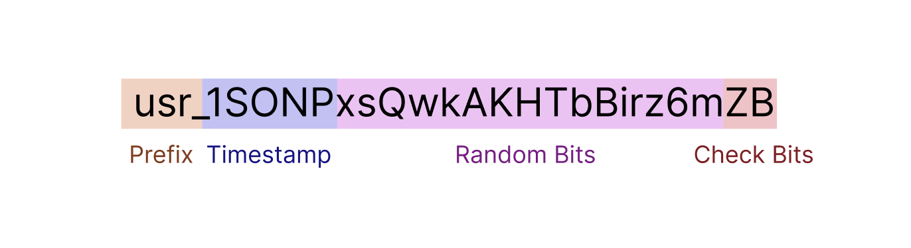

# sleekid

The globally unique ID for the modern software. Fully configurable. Stripe inspired.



```
Prefix := user defined string
Timestamp := base62(unix time - 2024-01-01), T: default is 5 digits.
Random := base62(N length of random digits), N: default is 12
Checksum := base62(C length of checksum digits), C: default is 2
Total length = Prefix + T + N + C
```

## Points

- Human-readable prefix
- More compact than UUID while maintaining collision resistance
  - when random digits length is 8, total length is near 16 bytes
  - shorter than UUID
- Timestamp
  - Sortable
  - B-tree optimized with built-in timestamps
  - Extract timestamp from id
- Built-in checksum verification
  - Detects errors with a probability of 99.97% with 2 checksum length.
- Cryptographically random
- URL friendly with base62 encoding
- Fully configurable
  - prefix: any string
  - delimiter: any single character
  - timestamp length: 4 ~ 6
  - checksum length: 1 ~ 3
    - checksum token: any 64-bit integer
  - random digits length: 1 ~

## Usage

```go
import "github.com/u17g/sleekid"

// Setup generator, before using sleekid.
sleekid.Setup(sleekid.GeneratorInit{
  // Change this token on your production environment.
  // and keep it secret.
  ChecksumToken:      729823908348,

  // Optional
  RandomDigitsLength: 12,
  Delimiter:          '_',
  ChecksumLength:     2,
  TimestampLength:    5,
  TimestampOrder:     sleekid.TimestampOrderAlphabetical,
})

// Generate id.
id, err := sleekid.New("usr")

// Generate id with custom random digits length
id, err := sleekid.New("usr", sleekid.WithRandomDigits(27))

// Validate id.
sleekid.Validate(id)
sleekid.ValidateWithPrefix("usr", id)

// Get Prefix
prefix := sleekid.Prefix(id)

// Get Timestamp
timestamp := sleekid.Timestamp(id)

// Custom Generator
gen := sleekid.NewGenerator(sleekid.GeneratorInit{
  // ...
})
id, err := gen.New("usr")
gen.Validate(id)
```


## Theory

### Space Size

timestamp part with 4 ~ 6 digits.
- Each character: 62 possibilities (0-9, a-z, A-Z)
- 6 digits: 62^6 ≈ 56.8 quadrillion combinations


random digits part with N length

- Each character: 62 possibilities (0-9, a-z, A-Z)
- N characters: 62^N possible combinations
- For N=12: 62^12 ≈ 3.22 × 10^21 combinations

total space
- Combined unique possibilities: 62^6 * 62^N = 62^(6+N)
- For N=12: 62^18 ≈ 1.83 × 10^32 combinations

### Tamper Detection Probability

- Tamper detection probability is 99.97% when checksum length is 2 digits
  - where 1 - 1/62^2 ≈ 0.9997
- This helps to prevent brute-force attacks / DDoS / etc.

### Length Recommendations

- For small scale systems (<100K IDs/day): N=10
- For medium scale systems (<10M IDs/day): N=12
- For large scale systems (>10M IDs/day): N=14
- For extreme scale systems (>1B IDs/day): N=16

## Benchmark

```
$ go test -bench . -benchmem

goos: darwin
goarch: arm64
pkg: github.com/u17g/sleekid/v2
cpu: Apple M4
BenchmarkNew-10                   	 4227106	       280.4 ns/op	      56 B/op	       4 allocs/op
BenchmarkPrefix-10                	80938208	        15.29 ns/op	      16 B/op	       2 allocs/op
BenchmarkTimestamp-10             	25121528	        48.93 ns/op	       0 B/op	       0 allocs/op
BenchmarkValidate-10              	39671715	        30.22 ns/op	       2 B/op	       1 allocs/op
BenchmarkValidateWithPrefix-10    	37104268	        32.39 ns/op	       2 B/op	       1 allocs/op
BenchmarkNewUUID-10               	 6279432	       191.4 ns/op	      16 B/op	       1 allocs/op
BenchmarkNewXid-10                	35857108	        33.87 ns/op	       0 B/op	       0 allocs/op
```
